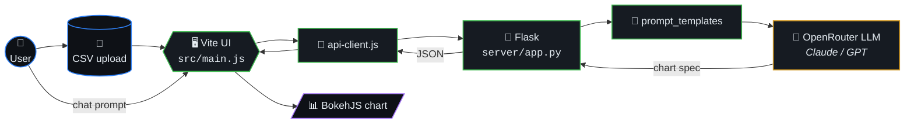
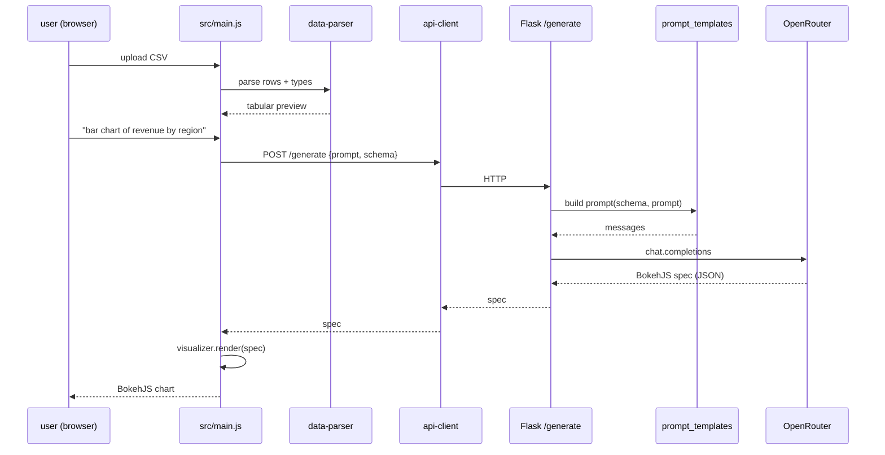
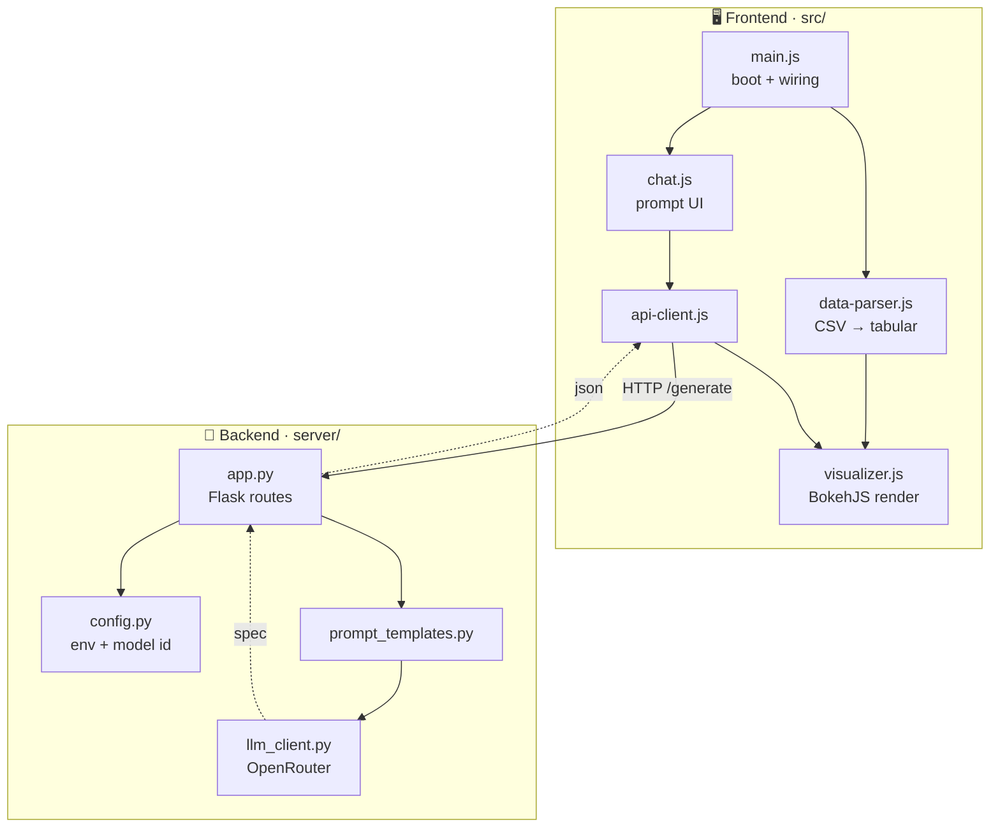
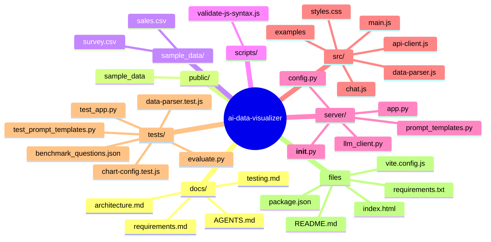
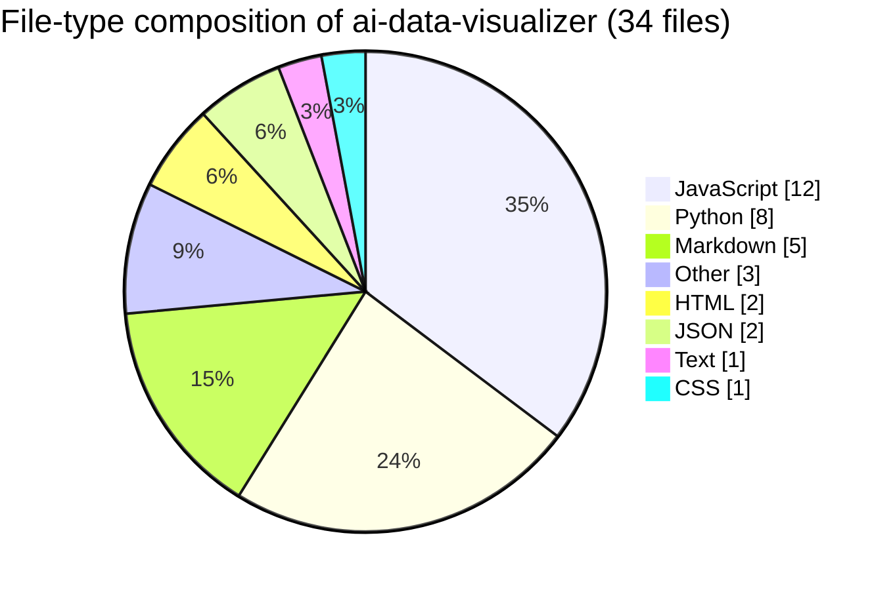

# ai-data-visualizer

> AI-powered data visualizations: upload a CSV, describe the chart in natural
> language, get a rendered BokehJS chart back. Vite + vanilla JS frontend,
> Flask + LLM backend.



## Table of contents

- [Quick start](#quick-start)
- [Architecture at a glance](#architecture-at-a-glance)
- [Chart generation (sequence)](#chart-generation-sequence)
- [Usage](#usage)
- [Project layout](#project-layout)
- [Testing](#testing)
- [Docs](#docs)
- [🗺️ Repository map](#️-repository-map)
- [📊 Code composition](#-code-composition)

## Chart generation (sequence)



## Quick start

```bash
npm install
pip3 install -r requirements.txt
npm run start          # frontend (:5173) + backend (:5001)
```

Create a `.env` in the project root:

```
OPENROUTER_API_KEY=sk-or-v1-your-key-here
LLM_MODEL=anthropic/claude-sonnet-4-20250514
```

Without `OPENROUTER_API_KEY` the app runs in fallback demo mode.

## Architecture at a glance



## Usage

1. Open http://localhost:5173
2. Upload a CSV file
3. Type a visualization request (e.g. "Show a bar chart of revenue by region")
4. The AI returns a chart spec and the page renders it with BokehJS

## Project layout

```
src/                  # Vite frontend (vanilla JS)
  main.js             # boot, wiring
  chat.js             # prompt UI
  data-parser.js      # CSV parsing
  visualizer.js       # BokehJS rendering
  api-client.js       # backend HTTP
server/               # Flask API
  app.py              # routes
  config.py           # env / model id
  prompt_templates.py # LLM prompts
  llm_client.py       # OpenRouter client
sample_data/          # demo CSVs
gallery.html          # static chart gallery
tests/                # vitest + pytest
docs/architecture.md  # full design doc
```

## Testing

```bash
npm run lint
npm run test                                       # Vitest (frontend)
python3 -m pytest tests/ -v                        # Backend
python tests/evaluate.py --model claude            # 10-question benchmark
```

## Docs

See [docs/architecture.md](docs/architecture.md) for the full design.


## 🗺️ Repository map

Top-level layout of `ai-data-visualizer` rendered as a Mermaid mindmap (auto-generated from the on-disk tree).




## 📊 Code composition

File-type breakdown of source under this repo (skips `.git`, `node_modules`, build caches, lockfiles).


